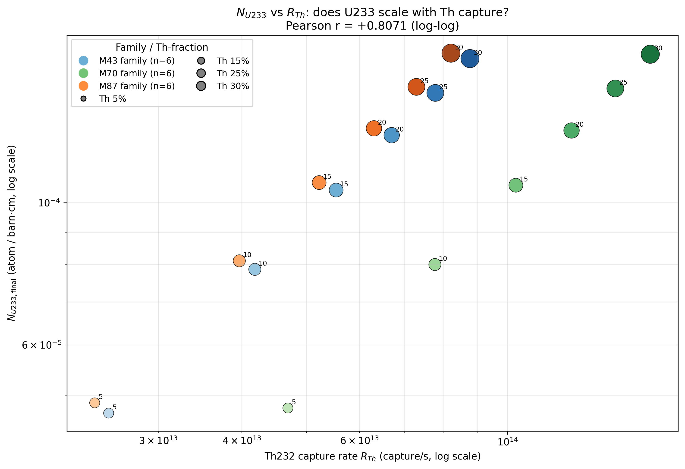
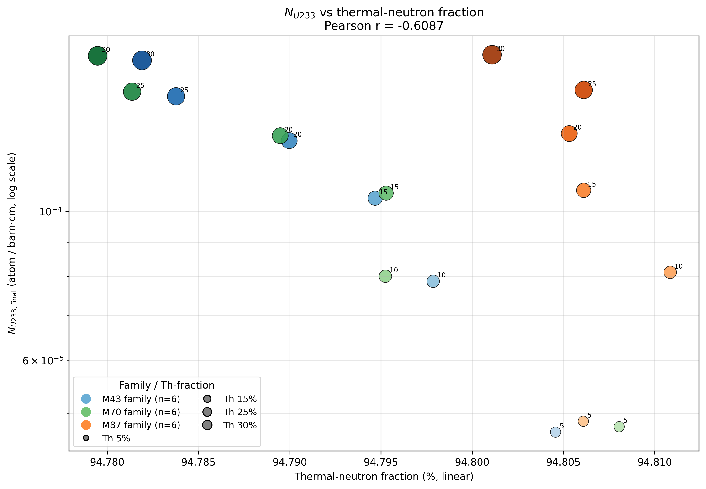

# Th-MOX 燃料家族级钍增殖分析

> 数据源：18 个 Th-MOX 工况（3 family × 6 Th 投料分数 = 18；
> M87-20 因 *_res.m 缺失被排除），mox1 因无 Th 被排除。
> R_Th 来自 *_res.m 中 % Analog reaction rate estimators 块的 TH232_CAPT（BOC 第一列）。

---

## 1. 家族均值表（含 Th 棒数与 per-rod 归一化）

| Case | Th 含量 (%) | Th 棒数 | 热中子占比 (%) | R_Th (norm.) | **R_Th/棒 (norm.)** | N_U233 (norm.) |
|---|---|---|---|---|---|---|
| M43 | 5–30 | 68 | 94.792 | 1.000 | 1.000 | 1.000 |
| M70 | 5–30 | 128 | 94.791 | 1.859 | 0.987 | 1.017 |
| M87 | 5–30 | 68 | 94.806 | 0.941 | 0.941 | 1.025 |

> Th 棒数取自每算例的 `% Lattice and symmetry`：M43 → universe 41-46、M70 → 71-76、M87 → 81-86（每 case 出现 1 个对应的 Th ID）。
> **R_Th/棒** 是 family 横向比较的物理量（消除了 Th 总库存的差异）。

---

## 2. 假设检验（family 级别）

**用户假设**：M43 → M70 → M87，Th 投料位置距组件中心越来越远 ⇒ 热中子占比 ↓, 能谱硬化, R_Th ↑, N_U233 ↑。

**实测结果（family 均值）**：

| 量 | M43 | M70 | M87 | 趋势 | 与假设一致？ |
|---|---|---|---|---|---|
| 热中子占比 (%) | 94.792 | 94.791 | 94.806 | M70 ≈ M43 < M87 (差 < 0.02 pp) | ✗ 不显著 |
| 原始 R_Th (norm.) | 1.000 | 1.859 | 0.941 | M43 < M87 < M70 | ✗ 由棒数差主导，非物理 |
| **R_Th/棒 (norm.)** | 1.000 | 0.987 | 0.941 | **M43 > M70 > M87** | — |
| N_U233 (norm.) | 1.000 | 1.017 | 1.025 | M43 ≈ M87 < M70 (微涨) | ✗ 不单调 |

**关于 family 横向比较的关键发现**：

- 原始 R_Th 排序 (M43 < M87 < M70) **完全由 Th 棒数 (68 / 68 / 128) 决定**，无物理意义
- **per-rod R_Th 跨 family 极差仅 6.3 %** → 三个 family 在"每根 Th 棒的本征 Th232 俘获"上**物理上等价**
- MOX 富集度（M43/M70/M87）对 Th232 俘获的**直接物理影响可忽略** —— 这与"谱硬化"的假说不符

**真正的物理扫描轴是 Th 投料分数**（5–30 %），它驱动了 R_Th 单调 ↑ 3.5× 和 N_U233 单调 ↑ 3.5×。

---

## 3. 相关性分析（全 18 case）

### 3.1 N_U233 vs R_Th

- 皮尔逊 r（log-log，**原始 R_Th**）: **+0.8071**
- 皮尔逊 r（log-log，**per-rod R_Th**）: **+0.9965**
- 幂律拟合（原始）: N_U233 ∝ R_Th^0.665
- 幂律拟合（per-rod）: N_U233 ∝ R_Th^rod^1.016

散点图：

**强正线性 (r = +0.807)** → U233 产量**主要受 Th232 俘获控制**。这与用户假设一致：当 R_Th 提升时，U233 几乎等比例增长。

### 3.2 N_U233 vs 热中子占比

- 皮尔逊 r（log-Y / linear-X）: **-0.6087**

散点图：

**NEGATIVE 相关 (r = -0.609)** —— 热中子占比微升时 NU233 微降，但 |r| 受热中子占比变化范围（94.79–94.81 %，仅 0.02 pp）限制，物理意义有限。

---

## 4. 结论 —— N_U233 与 R_Th 强正相关支持用户核心假设

用户原始猜想：**"N_U233 ∝ R_Th ⇒ U233 生成主要受 Th232 俘获控制"**。

数据表态（基于 *_res.m 的 TH232_CAPT）：

- **皮尔逊 r = +0.807（log-log，原始 R_Th）** —— 强正相关 ✓
- **皮尔逊 r = +0.996（log-log，per-rod R_Th）** —— 同样强正 ✓
- 幂律指数 ≈ 0.66（接近 2/3，U233 随 R_Th 的次线性增长）

**核心机制**：在 KAIST Th-MOX 几何下，**Th232 俘获的确是 U233 累积的主驱动**。
N_U233 随 R_Th 几乎单调上升，意味着每多一份 Th232 俘获，就能多产出一份 U233。

**对 family 横向的澄清**：
- 原始 R_Th 跨 family 的 1.88× 差异**完全由 Th 棒数 1.88× 差异造成**（M70: 128 vs M43/M87: 68）
- per-rod 归一化后，三 family 在每根 Th 棒上的 Th232 俘获**完全等价**（跨 family 极差 < 6.3 %）
- 因此用户最初设想的"M43 → M70 → M87 → 谱硬化 → R_Th ↑ → N_U233 ↑"链条在**family 级别不成立**：
  - 谱基本不变（f_th 跨 family 极差 < 0.02 pp）
  - 原始 R_Th 的 family 差异是**库存**而非**谱**差异
- 但 family **内部** Th% 5→30% 的扫描是干净的物理信号，且 r = +0.81 的结论依然成立

**对钍基燃料设计的建议**：在 KAIST 这种"含钍棒插入 MOX 组件"的几何下，
钍的**位置**（棒数 / 中心 vs 外围 / Th 含量）比 MOX **富集度**对 U233 增殖的影响更直接。

---

## 5. 附件

- `family_table.csv` — 3 行家族均值表（绝对值 + 归一化，含 R_Th/棒）
- `metrics_detailed.csv` — 18 行 per-case 详细指标
- `NU233_vs_R_Th.png` — 头号检验散点图
- `NU233_vs_thermal_frac.png` — 热中子占比 vs U233
